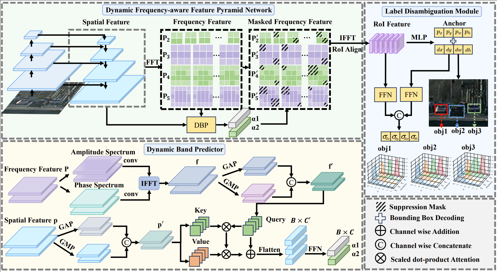

<div align="center">

<h1>DyFrDet: Towards Accurate Small Object Detection via Dynamic Frequency Suppression with Label Disambiguation</h1>

<div>
    <strong>Zihan Yang</strong><sup>1*</sup> &emsp;
    <strong>Yang Guo</strong><sup>2*</sup> &emsp;
    <strong>Hongxing Zhang</strong><sup>3</sup> &emsp;
    <strong>Dan Lu</strong><sup>1✉</sup> &emsp;
    <strong>Siyuan Yao</strong><sup>4✉</sup>
</div>
<br>
<div>
    <sup>1</sup> Hangzhou International Innovation Institute, Beihang University<br>
    <sup>2</sup> Beijing University of Posts and Telecommunications (BUPT)<br>
    <sup>3</sup> School of Beijing University of Posts and Telecommunications<br>
    <sup>4</sup> Shenzhen Campus of Sun Yat-sen University
</div>
<br>
<div>
    <sup>*</sup> <em>Equal contribution</em> &emsp; <sup>✉</sup> <em>Corresponding authors</em>
</div>
<br>

[](https://arxiv.org/abs/2608.02495)

---

</div>

> **🎉 Accepted by ACMMM 2026**  
> Official PyTorch implementation of **DyFrDet**.

📌 **Note:** This repository provides the official implementation of DyFrDet, designed to resolve background distractions in the frequency domain and mitigate label ambiguity in small object detection.

## 📖 Abstract

Despite the remarkable progress over the past decades, accurately identifying small objects remains challenging because of their insufficient visual cues. Previous works typically attempt to construct discriminative representation of the small objects. However, the wide range frequency domain noises and label ambiguities have been greatly overlooked, which significantly hinders the accurate localization. To address these issues, we propose a novel small object detection (SOD) detector termed DyFrDet, which is able to precisely localize the small object by dynamically suppressing the background distractions in frequency domain. Specifically, we propose a Dynamic Frequency-aware Feature Pyramid Network (DyFrFPN) to adaptively suppress low-frequency redundancy and excessive high-frequency noises. The DyFrFPN transforms the hierarchical features into frequency domain representation, and introduces a Dynamic Band Predictor (DBP) to preserve the discriminative components for small object identification. Afterwards, we present a novel Label Disambiguation Module (LDM), which leverages probabilistic distributions to explicitly model and alleviate the inherent ambiguity of target labels, yielding efficient improvement in localization precision of the small objects with low-resolution. Extensive experiments demonstrate that DyFrDet achieves state-of-the-art performance across multiple benchmarks, indicating its effectiveness and robustness in various challenging scenarios.

---

## 🎬 Overview

<p align="center">
  
</p>

The overall architecture of **DyFrDet** consists of two main components:
1. **Dynamic Frequency-aware Feature Pyramid Network (DyFrFPN):** Integrates a **Dynamic Band Predictor (DBP)** that adaptively predicts channel-wise frequency thresholds ($\alpha_1, \alpha_2$) to suppress low-frequency redundancies and high-frequency noises simultaneously.
2. **Label Disambiguation Module (LDM):** Models bounding box coordinates via probabilistic distributions to mitigate label ambiguity, paying more attention to high-confidence samples and restraining ambiguous ones.

---

## 🎯 Performance

> **Note:** Metrics follow COCO-style evaluation. **Bold** numbers indicate the best results.

### Table 1. AI-TOD Benchmark
* **Training Set:** AI-TOD trainval set
* **Testing Set:** AI-TOD test set (36 epochs)

| Method | Source | Backbone | AP | AP<sub>50</sub> | AP<sub>75</sub> | AP<sub>vt</sub> | AP<sub>t</sub> | AP<sub>s</sub> | AP<sub>m</sub> |
| :--- | :---: | :---: | :---: | :---: | :---: | :---: | :---: | :---: | :---: |
| DAB-DETR | ICLR2022 | R50 | 4.9 | 16.0 | 1.7 | 1.7 | 3.6 | 7.0 | 18.0 |
| DAB-Deformable-DETR | ICLR2022 | R50 | 16.5 | 42.6 | 9.9 | 7.9 | 15.2 | 23.8 | 31.9 |
| DINO-Deformable-DETR | ICLR2023 | R50 | 23.2 | 56.6 | 15.4 | 9.9 | 23.1 | 29.3 | 37.6 |
| DINO-5scale w/ SET | CVPR2025 | R50 | 26.6 | 57.1 | 20.8 | 13.2 | 27.1 | 31.5 | -- |
| Faster R-CNN | TPAMI2017 | R50+FPN | 11.1 | 26.3 | 7.6 | 0.0 | 7.2 | 23.3 | 33.6 |
| Cascade R-CNN | CVPR2018 | R50+FPN | 13.8 | 30.8 | 10.5 | 0.0 | 10.5 | 25.5 | 36.6 |
| DetectorRS | CVPR2021 | R50+FPN | 14.8 | 32.8 | 11.4 | 0.0 | 10.8 | 28.3 | 38.0 |
| QueryDet | CVPR2022 | R50+FPN | 12.2 | 29.3 | 7.9 | 2.4 | 10.5 | 18.5 | 26.3 |
| CFINet | ICCV2023 | R50+FPN | 24.7 | 53.9 | 18.6 | 11.7 | 26.4 | 28.1 | 32.2 |
| KLDet | TGRS2024 | R50+FPN | 19.6 | 46.4 | 13.7 | 8.4 | 20.6 | 22.7 | 26.4 |
| RFLA | ECCV2022 | R50 w/SAC+FPN | 24.8 | 55.2 | 18.5 | 9.3 | 24.8 | 30.3 | 38.2 |
| DNTR | TGRS2024 | R50 w/SAC+FPN | 26.2 | 56.7 | 20.2 | 12.8 | 26.4 | 31.0 | 37.0 |
| SimD | IROS2024 | R50 w/SAC+FPN | 26.6 | 55.9 | 21.2 | 13.4 | 27.5 | 30.9 | 37.8 |
| DetectorRS w/FIDP | CVPR2025 | R50 w/SAC+FPN | 24.3 | 54.4 | 18.3 | 8.5 | 24.9 | 29.8 | -- |
| HS-FPN | AAAI2025 | R50 w/SAC+FPN | 25.1 | 55.7 | 19.1 | 12.1 | 25.3 | 29.9 | 36.9 |
| **DyFrDet** | -- | R50+DyFrFPN | 26.0 | 55.3 | 19.6 | 13.6 | 27.3 | 29.0 | 34.5 |
| **DyFrDet\*** | -- | R50 w/SAC+DyFrFPN | **28.7** | **57.2** | **23.7** | **15.2** | **29.1** | **33.3** | **39.6** |

### Table 2. SODA-D Benchmark
* **Training Set:** SODA-D train set
* **Testing Set:** SODA-D test set (12 epochs)

| Method | Source | Backbone | AP | AP<sub>50</sub> | AP<sub>75</sub> | AP<sub>es</sub> | AP<sub>rs</sub> | AP<sub>gs</sub> | AP<sub>N</sub> |
| :--- | :---: | :---: | :---: | :---: | :---: | :---: | :---: | :---: | :---: |
| RetinaNet | ICCV2017 | R50+FPN | 28.2 | 57.6 | 23.7 | 11.9 | 25.2 | 34.1 | 44.2 |
| FCOS | ICCV2019 | R50+FPN | 23.9 | 49.5 | 19.9 | 6.9 | 19.4 | 30.9 | 40.9 |
| ATSS | CVPR2020 | R50+FPN | 26.8 | 55.6 | 22.1 | 11.7 | 23.9 | 32.2 | 41.3 |
| DyHead | CVPR2021 | R50+FPN | 27.5 | 56.1 | 23.2 | 12.4 | 24.4 | 33.0 | 41.9 |
| KLDet | TGRS2024 | R50+FPN | 25.9 | 53.8 | 21.4 | 10.7 | 22.2 | 31.9 | 41.6 |
| CFPT | TGRS2025 | R50+CFPT | 27.5 | 54.5 | 23.8 | 7.1 | 22.4 | 36.2 | 45.9 |
| Faster R-CNN | TPAMI2017 | R50+FPN | 28.9 | 59.7 | 24.2 | 13.9 | 25.6 | 34.3 | 43.2 |
| Cascade RPN | NIPS2019 | R50+FPN | 29.1 | 56.5 | 25.9 | 12.5 | 25.5 | 35.4 | 44.7 |
| RFLA | ECCV2022 | R50+FPN | 29.7 | 60.2 | 25.2 | 13.2 | 26.9 | 35.4 | 44.6 |
| CFINet | ICCV2023 | R50+FPN | 30.7 | 60.8 | 26.7 | 14.7 | 27.8 | 36.4 | 44.6 |
| DNTR | TGRS2024 | R50 w/SAC+RFP | 29.6 | 57.8 | 26.5 | 13.1 | 26.7 | 35.5 | 43.4 |
| HS-FPN | AAAI2025 | R50+FPN | 29.6 | 56.8 | 26.7 | 13.6 | 26.4 | 35.3 | 45.3 |
| **DyFrDet** | -- | R50+DyFrFPN | **31.3** | **62.1** | **26.8** | **15.1** | **27.8** | **37.3** | **46.2** |

### Table 3. SODA-A Benchmark (Oriented Object Detection)
* **Training Set:** SODA-A train set
* **Testing Set:** SODA-A test set (12 epochs)

| Method | Source | Backbone | AP | AP<sub>50</sub> | AP<sub>75</sub> | AP<sub>es</sub> | AP<sub>rs</sub> | AP<sub>gs</sub> | AP<sub>N</sub> |
| :--- | :---: | :---: | :---: | :---: | :---: | :---: | :---: | :---: | :---: |
| Rotated RetinaNet | ICCV2017 | R50+FPN | 26.8 | 63.4 | 16.2 | 9.1 | 22.0 | 35.4 | 28.2 |
| Oriented RepPoints | CVPR2022 | R50+FPN | 26.3 | 58.8 | 19.0 | 9.4 | 22.6 | 32.4 | 28.5 |
| DHRec | TPAMI2022 | R50+FPN | 30.1 | 68.8 | 19.8 | 10.6 | 24.6 | 40.3 | 34.6 |
| LEGNet | ICCVW2025 | LWGNet+FPN | 29.6 | 58.7 | 26.4 | 10.4 | 26.0 | 39.6 | 32.0 |
| Rotated Faster R-CNN | TPAMI2017 | R50+FPN | 32.5 | 70.1 | 24.3 | 11.9 | 27.3 | 42.2 | 34.4 |
| Gliding Vertex | TPAMI2020 | R50+FPN | 31.7 | 70.8 | 22.6 | 11.7 | 27.0 | 41.1 | 33.8 |
| Oriented R-CNN | ICCV2021 | R50+FPN | 34.4 | 70.7 | 28.6 | 12.5 | 28.6 | 44.5 | 36.7 |
| CFINet | ICCV2023 | R50+FPN | 34.4 | 73.1 | 26.1 | 13.5 | 29.3 | 44.0 | 35.9 |
| DecoupleNet | TGRS2024 | DecoupleNet+FPN | 36.6 | 71.3 | 33.3 | 12.2 | 31.0 | 47.7 | 40.2 |
| GauCho | CVPR2025 | R50+FPN | 33.2 | 70.1 | 25.0 | 9.9 | 27.8 | 44.9 | 36.4 |
| Unc-SOD | TIP2026 | R50+FPN | 34.8 | 73.6 | 26.4 | 13.8 | 29.7 | 44.7 | 36.5 |
| **DyFrDet** | -- | R50+DyFrFPN | 36.0 | 73.3 | 30.1 | 13.8 | 30.6 | 46.0 | 38.0 |
| **DyFrDet\*** | -- | DecoupleNet+DyFrFPN | **37.8** | **73.4** | **34.3** | **12.9** | **31.9** | **49.5** | **41.0** |

---

## 🛠️ Get Started

### 1. Environment Setup

```bash
# Create conda environment with Python 3.8
conda create -n DyFrDet python=3.8 -y
conda activate DyFrDet

# Upgrade pip and Install PyTorch 1.12.0 with CUDA 11.3 support
pip install --upgrade pip
pip install torch==1.11.0+cu113 torchvision==0.12.0+cu113 torchaudio==0.11.0 --extra-index-url https://download.pytorch.org/whl/cu113

# Install basic requirements HBB or OBB
cd mmdet-dyfrdet or cd mmrotate-dyfrdet
pip install -r requirements.txt

# Install mmcv-full using openmim
pip install -U openmim
mim install mmcv-full==1.5.0 or mim install mmcv-full==1.7.2 

pip install -e ./mmdet-dyfrdet or pip install -e ./mmrotate-dyfrdet

pip install yapf==0.40.1
pip install cython==0.29.33
pip install -e cocoapi-aitod-master/aitodpycocotools

pip install future tensorboard timm
```
🔧 Code Modification (Important)

To ensure training proceeds correctly, a minor patch needs to be applied to the installed `mmcv` library file:

> 📌 **Target Path:** > `YOUR_CONDA_ENV_PATH/DyFrDet/lib/python3.8/site-packages/mmcv/runner/epoch_based_runner.py`

```python
# ... Existing Code ...
# Insert data_batch['epoch'] = self.epoch right before the train_step call
data_batch['epoch'] = self.epoch
outputs = self.model.train_step(data_batch, self.optimizer, **kwargs)
# ... Existing Code ...
```

### 2. Dataset Preparation
The SODA dataset is processed following the protocol of CFINet. We provide the pre-processed datasets below:

- **AI-TOD**: [Quark Drive](https://pan.quark.cn/s/2b62b25c34ef?pwd=hBv1)
- **SODA-D**: [Quark Drive](https://pan.quark.cn/s/2b62b25c34ef?pwd=hBv1)
- **SODA-A**: [Quark Drive](https://pan.quark.cn/s/2b62b25c34ef?pwd=hBv1)

Please arrange your dataset directories as follows:
```
├── AI-TOD
│   ├── annotations
│   │   ├── aitod_trainval_v1.json
│   │   └── aitod_test_v1.json
│   ├── trainval
│   └── test
│
└── SODA
    ├── SODA-D
    └── SODA-A
```

### 3. Download Pretrained Weights

We provide the pretrained checkpoints needed for **DyFrDet** training setting.
[Link](https://pan.quark.cn/s/c54571377060?pwd=qimG#/list/share/c12bdc7fd7e445b5b3aea2f5d57013f7)


### 4. Train & Evaluation

#### Modify Configuration

Before training and evaluation, please modify the following configurations according to your environment:

**1. Dataset paths (`data_root`)**

Update `data_root` in the following dataset configuration files:

- `mmdet-dyfrdet/configs/_base_/datasets/aitod_detection.py`

- `mmdet-dyfrdet/configs/_base_/datasets/sodad.py`

- `mmrotate-dyfrdet/configs/_base_/datasets/sodaa.py`

**2. Checkpoint Path**

Modify the pretrained checkpoint path of DecoupleNet in:

- `mmrotate-dyfrdet/configs/dyfrdet/sodaa_detector_dyfrdet_1x.py`

#### Training
```bash
# HBB version
cd mmdet-dyfrdet
python tools/train.py configs/dyfrdet/aitod_detector_dyfrdet_star_2x.py --work-dir DyFrDet_Star

# OBB version
cd mmrotate-dyfrdet
python tools/train.py configs/dyfrdet/sodaa_detector_dyfrdet_star_1x.py --work-dir DyFrDet_Rotate_Star
```

#### Evaluation
```bash
# CNN version
python tools/test.py configs/dyfrdet/aitod_detector_dyfrdet_star_2x.py DyFrDet_Star/epoch_xxx.pth --eval bbox

# Mamba version
python tools/test.py configs/dyfrdet/sodaa_detector_dyfrdet_star_1x.py DyFrDet_Rotate_Star/epoch_xxx.pth --eval bbox
```

### 5. Export the HBB detector to ONNX

The HBB detector uses a custom two-stage CRPN head. Its ONNX path is implemented in `CRPNHead.onnx_export`, so export the detector through the existing MMDetection deployment script instead of wrapping `simple_test` (which returns Python lists and NumPy arrays):

```bash
cd mmdet-dyfrdet
python tools/deployment/pytorch2onnx.py \
  configs/dyfrdet/aitod_detector_dyfrdet_star_2x.py \
  DyFrDet_Star/epoch_xxx.pth \
  --input-img demo/demo.jpg \
  --output-file DyFrDet_Star/epoch_xxx.onnx \
  --verify
```

The exported model has one `input` tensor and two outputs: `dets` with shape `(B, N, 5)` (`x1, y1, x2, y2, score`) and `labels` with shape `(B, N)`. The ONNX branch keeps the detector, cascade uncertainty regression, CRPN/LDM post-processing, and DyFrFPN frequency residual in tensor form. Since PyTorch 1.11 does not provide an ONNX symbolic for `torch.fft`, DyFrFPN uses an equivalent real-valued DFT/IFFT implementation during export (the regular PyTorch path is unchanged). Models containing MMCV deformable convolutions also require the MMCV ONNX Runtime custom-op library at inference time. Export with the same square input shape and preprocessing used by deployment; the exporter requires the ONNX dependencies from `mmdet-dyfrdet/requirements.txt` and the same MMCV version used by the checkpoint.

### 6. Model Zoo

We provide the complete pretrained checkpoints for evaluating and reproducing the results of **DyFrDet**. 
[Link](https://pan.quark.cn/s/c54571377060?pwd=qimG)

## 📬 Contact
* **Yang Guo:** [guoyang4409@gmail.com](mailto:guoyang4409@gmail.com)
* **Zihan Yang:** [zihanyang@buaa.edu.cn](mailto:zihanyang@buaa.edu.cn)
* **Siyuan Yao:** [yaosiyuan04@gmail.com](mailto:yaosiyuan04@gmail.com)

## 🤝 Acknowledgements
Special thanks to the authors of [CFINet](https://github.com/shaunyuan22/CFINet), [RFLA](https://github.com/Chasel-Tsui/mmdet-rfla), which helped us quickly implement our ideas.

## ✏️ Citation
If you find this project helpful for your research, please consider leaving a star ⭐️ and citing our paper:
```bibtex
@misc{yang2026dyfrdetaccuratesmallobject,
      title={DyFrDet: Towards Accurate Small Object Detection via Dynamic Frequency Suppression with Label Disambiguation}, 
      author={Zihan Yang and Yang Guo and Hongxing Zhang and Dan Lu and Siyuan Yao},
      year={2026},
      eprint={2608.02495},
      archivePrefix={arXiv},
      primaryClass={cs.CV},
      url={https://arxiv.org/abs/2608.02495}, 
}
```
